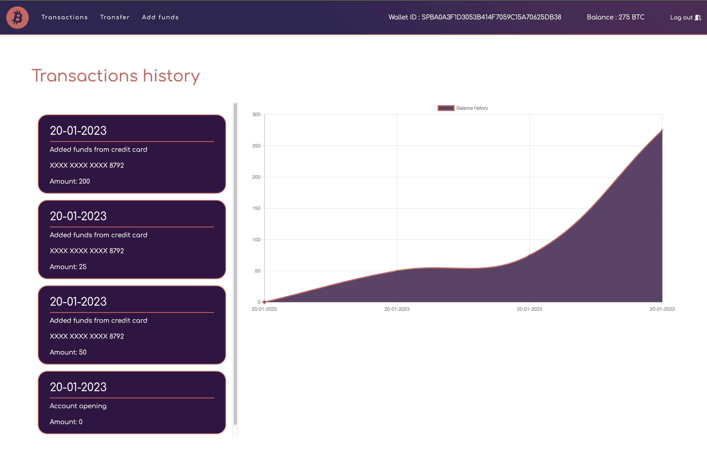
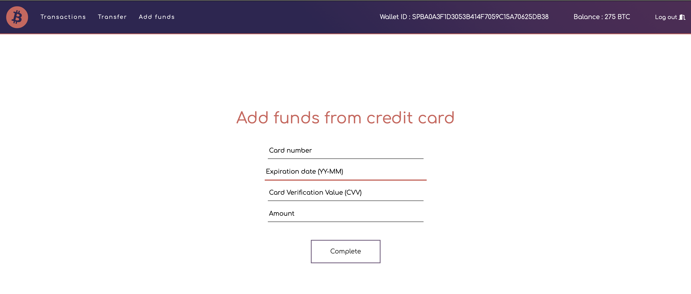
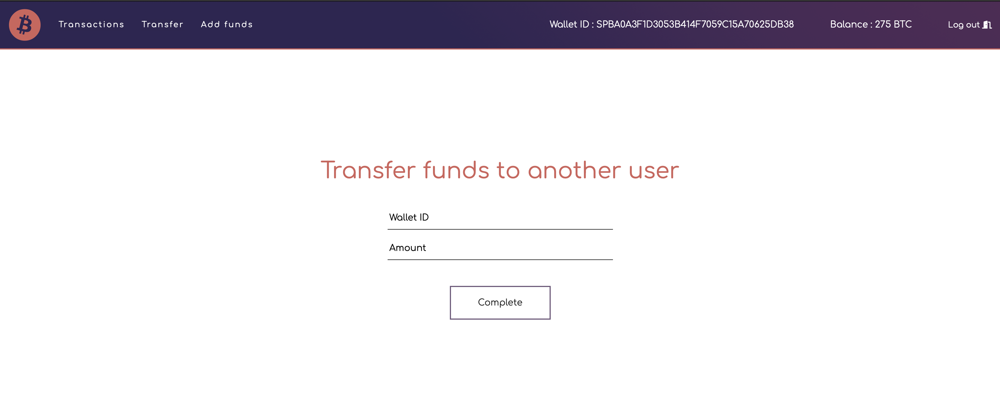

# Projet web NodeJS - SpaceBank
## Concept
Il fallait développer un site web en utilisant NodeJS avec le framework Express, base de donnée NoSQL MongoDB, Session avec Redis, sous le thème d'un système de banque. Il fallait permettre l'ajout de fonds par une carte de crédit artificielle fournie par notre professeur et qu'on devait communiquer avec son API REST pour pouvoir valider l'identité de la carte et les fonds demandés. Il fallait aussi gérer plusieurs utilisateurs et le transfer de fonds entre les comptes. Il y a aussi une page d'historique de toutes les transactions du compte. Il fallait aussi gérer l'encryption des données critiques.

## Média(s)
### Page d'accueil 

### Page des transactions

### Page d'ajout de fonds

### Page de transfer de fonds

## Technologies
- NodeJS
- Express Framework
- Express Validator
- MongoDB
- Redis Server
- Encryption Bcrypt
- Pug template engine
